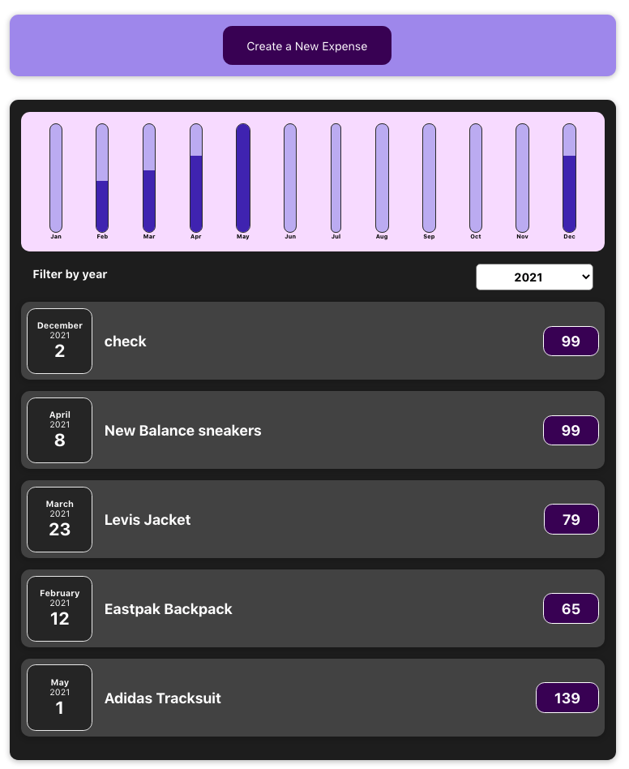
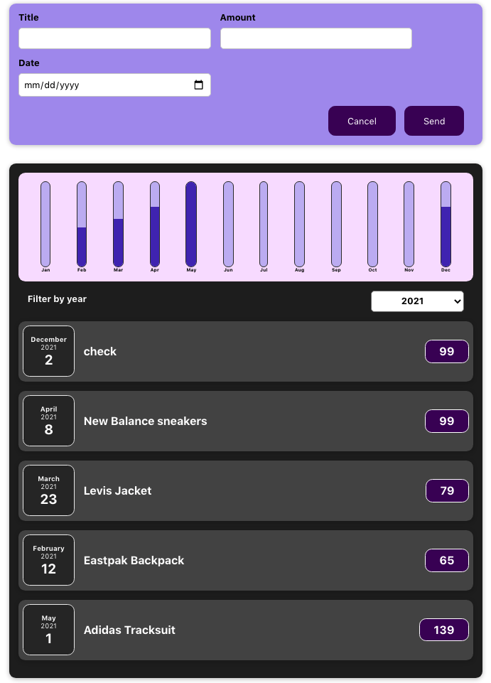

# Basic React appliction to track expenses

**What's implemented here?**

- Data passing through props
- Passing data child-to-parent through parameter functions
- State saving via useState
- Handling onChange and onClick events

